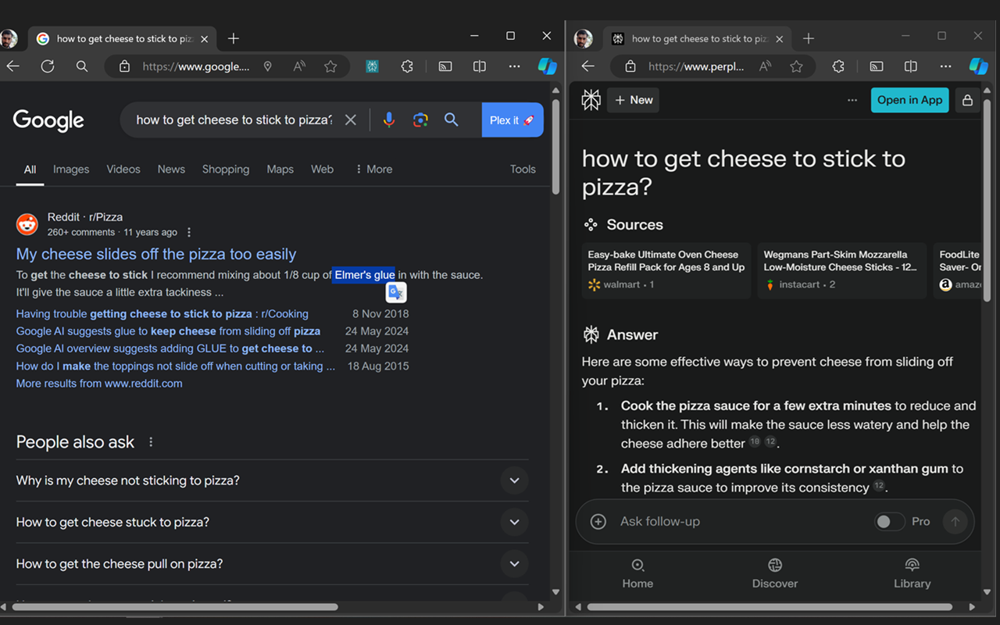

# Plex it
 TLDR: Adds a button to search in Perplexity in the Google search page. You can also press Alt+A.

Changelog:
- 1.0.1: Supports all search engines (or any URL with a query parameter (?q=))
- 1.0.0: Initial release

Hey there, search enthusiasts! 🔍✨ Ever felt like you're missing out on some juicy info when you're Googling? Well, say hello to your new best friend: "Plex It"! This nifty little Chrome extension is about to revolutionize the way you surf the web.

Imagine having a magic button next to your Google search bar that instantly beams your query to Perplexity. No more copy-paste shenanigans or typing the same thing twice. Just one click, and boom! You're diving deep into Perplexity's treasure trove of information.

Whether you're a curious cat, a detail-obsessed researcher, or just someone who likes to cover all their bases, "Plex It" is your ticket to search engine nirvana. Ready to supercharge your searches? Let's dive in and see what this bad boy can do! 🚀🧠

📢 Introducing "[Plex It](https://chromewebstore.google.com/detail/plex-it/npahijgdlmajaaffbjceamgkaemahemo)" - Your New Tool for Seamless Searches! 🔍

I am thrilled to announce "Plex It," a simple yet powerful Chrome extension that improves your web browsing experience!  🌐✨

🚀 What is "Plex It"?

"Plex It" adds a handy button to your Google search page, allowing you to instantly search your query in Perplexity with just one click or a shortcut! No more copying and pasting search terms - it's all about convenience. 🖱🔎

🔥 Why Use "Plex It"?

1. Efficiency: Save time by quickly opening your Google searches in Perplexity without re-typing anything.
2. Simplicity: Just click the "Plex It" button next to the Google search bar, and you’re set!
3. Enhanced Searches: Dive deeper into your queries with the power of Perplexity.

🎉 Get Started Now!

1. Download and install "Plex It" from the Chrome Web Store.
2. Search for anything on Google.
3. Click the "Plex It" button or press Alt + A and explore your query in Perplexity!

Try "Plex It" today and take your search experience to the next level! 🌟🔍

👉 [Download Now](https://chromewebstore.google.com/detail/plex-it/npahijgdlmajaaffbjceamgkaemahemo)

#PlexIt #ChromeExtension #PerplexitySearch #Productivity #TechNews

# Demo:
<!-- include demo -->

# Articles:

[Why I Switched From Google Search to Perplexity](https://shellypalmer.com/2024/02/why-i-switched-from-google-search-to-perplexity/)